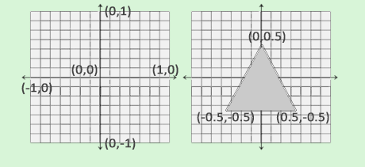

# Introduction
OpenGL is a specification of behaviour that an OpenGL implementation should follow to correctly draw figures on screen.
It is up to the hardware manufacturer to actually implement an OpenGL library fully compliant with the specification.
Typically, whenever you are updating the GPU driver, you are also updating the OpenGL library written and maintained by
your GPU manufacturer.

You can imagine OpenGL as a big state machine: each frame OpenGL draws on screen whatever it has in its current state,
and changing its state will also change the output. The OpenGL current state is called **OpenGL Context**

OpenGL abstract itself from the windows manages, since it is out of its scope. Instead, you need other libraries such as
**GLFW** and **GLAD** to handle that. They are specifically made to work with OpenGL, and they are hardware and OS dependant.

# Hello Window
To create a window, we firstly need to set up the context:
```c++
int main()
{
    glfwInit();
    glfwWindowHint(GLFW_CONTEXT_VERSION_MAJOR, 3);
    glfwWindowHint(GLFW_CONTEXT_VERSION_MINOR, 3);
    glfwWindowHint(GLFW_OPENGL_PROFILE, GLFW_OPENGL_CORE_PROFILE);
  
    return 0;
}
```

With `glfwInit()` we initialize GLFW, then we start configuring it using `glfwWindowHint`.
Firstly, thanks to the flag `GLFW_CONTEXT_VERSION_XXX` we set the minimum and maximum supported version. In this case
(and repository), we set `3` as we are using `OpenGL 3.3`. In the last line we are telling OpenGL that we want to use
the `CORE_PROFILE`. This means that we are telling GLFW that we want to use the OpenGL `core-profile` subset of features
without backward compatibility.

Finally, we can create a window object:
```c++
GLFWwindow* window = glfwCreateWindow(800, 600, "Hello Window!", NULL, NULL);
if (window == NULL)
{
    std::cout << "Failed to create GLFW window" << std::endl;
    glfwTerminate();
    return -1;
}
glfwMakeContextCurrent(window);
```

The `glfwCreateWindow` function takes in input the `width`, the `height`, the `name` of the window and two other parameters
that we can ignore for now. This function returns a `GLFWWindow` object. We then check if the window is correctly created,
and we log some error messages if it has not been created correctly.
If everything is working correctly, we set the current context to that window with `glfwMakeContextCurrent(window)`.

## Managing OpenGL pointers
As we said before, OpenGL is not properly a library but more of a specification. To correctly manage calls to OpenGL,
we need an additional piece of software. In our case, `GLAD`.
```c++
if (!gladLoadGLLoader((GLADloadproc)glfwGetProcAddress))
{
    std::cout << "Failed to initialize GLAD" << std::endl;
    return -1;
} 
```

Here we are initializing `GLAD` to load the correct addresses of OpenGL functions, which are OS-specific. `glfwGetProcAddess`
returns the correct address, given the OS. We then convert that output to a `GLADloadproc` object, and we check if everything
worked correctly.

## Viewport
Before rendering our window, we need to tell OpenGL the size of the rendering. In this way OpenGL knows how we want to
display the data and coordinates with respect to the window
```c++
glViewport(0,0,800,600);
```

The first two parameters set the location of the lower left corner of the window. The third and the fourth set the `widht`
and the `height` of the rendering window in pixels.
> [!IMPORTANT]
> It is important to set the `widht` and the `height` to the same values of the `GLFW`'s window size. If we do not do that,
> the rendering will use less/more window space than the one specified.

> [!NOTE]
> OpenGL uses a coordinate system normalized: from (-1,-1) to (1,1). When you want to draw something on screen, OpenGL
> handles the implicit conversion between the normalized coordinate form to the actual pixel position (-0.5,0.5) -> (200, 450)

If the user resizes our window, we need to update the viewport as well. To do so, we need a callback function
```c++
void framebuffer_size_callback(GLFWwindow* window, int width, int height)
{
    glViewport(0, 0, width, height);
}  
```

And then we map this function to our `window` variable

```c++
glfwSetFramebufferSizeCallback(window, framebuffer_size_callback);  
```

## Displaying the window
Now it is time to display the window. We want to keep the program alive, otherwise the window would be displayed for just 
one frame and then it will disappear.
```c++
while(!glfwWindowShouldClose(window))
{
    glfwSwapBuffers(window);
    glfwPollEvents();    
}
```

This event loop handles that. The `glfwWindowShouldClose` function checks if GLFW has been isntructed to close.
The `glfwPollEvents` functions checks if any events are triggered ad it updates the window state. To actually do somethings,
we need to registers functions as callbacks.
The `glfwSwapBuffers` will swap the color buffer that is used to render to during this render iteration and show it as 
output of the screen. This is done to avoid flickering: drawing on screen and rendering take some times. To avoid this issue,
there are actually two buffers: a `front` buffer, that contains the final output image that is shown at the screen, and a `back`
buffer, that renders the next image to be shown. As soon as the rendering is complete, we swap the two buffers

As a last thing, to properly clean and delete all GLFW's resources that were allocated, we call `glfwTerminate`.
```c++
glfwTerminate();
return 0;
```

## Processing inputs
As said before, `glfwPollEvents` take care of user input, but we need to define callbacks
```c++
void processInput(GLFWwindow *window)
{
    if(glfwGetKey(window, GLFW_KEY_ESCAPE) == GLFW_PRESS)
        glfwSetWindowShouldClose(window, true);
}
```
Here's a simple callback. We are checking if the `escape` key (`GLFW_KEY_ESCAPE`) has been pressed (`GLFW_PRESS`) using
the function `glfwGetKey`. If that's the case, we close the window with `glfwSetWindowShouldClose(window, true)`.
Then we update our loop accordingly
```c++
while (!glfwWindowShouldClose(window))
{
    processInput(window);

    glfwSwapBuffers(window);
    glfwPollEvents();
} 
```

## Rendering colors
Finally, we want to see if we are able to render some colors
```c++
// render loop
while(!glfwWindowShouldClose(window))
{
    // input
    processInput(window);

    // rendering commands here
    glClearColor(0.2f, 0.3f, 0.3f, 1.0f);
    glClear(GL_COLOR_BUFFER_BIT);

    // check and call events and swap the buffers
    glfwPollEvents();
    glfwSwapBuffers(window);
}
```
When calling `glClear(GL_COLOR_BUFFER_BIT)` we are cleaning the screen with the color defined with `glClearColor()`.
Note that the color format is `rgba` normalized, with values from `0` to `1`

# Hello Triangle
In OpenGL, everything is in a 3D space. Most of the work is converting object in a 3D space into a 2D plane to be
displayed onto your screen. The process of transforming 3D coordinates to 2D pixels is called **graphic pipeline**.

## Graphic pipeline
The graphic pipeline can be divided into two large parts:
* The first transforms the 3D coordinate into a 2D coordinate
* The second transforms the 2D coordinate into actual colored pixels

Beside this high level view, the graphics pipeline can be divided into several highly specialized steps that can be executed
in parallel. These small programs that compose the pipeline are called **shaders**.
Some of these shaders are configurable by the developer, that can write their own. Shaders are written with the OpenGL Shading Language
(**GLSL**).

Here's an abstract representation of all the stages of the graphics pipeline. The blue sections are the one we can inject changes

*Credit to https://learnopengl.com/Getting-started/Hello-Triangle*

As the input of the pipeline we pass a list of 3D coordinates that should form a triangle.
> [!IMPORTANT]
> Remember that GPU can only draw points, lines and triangles!

It is also important to tell OpenGL what to do with the data, so it can interpret them correctly. These are called "hints"
and some of them are `GL_POINTS`, `GL_TRIANGLES` and `GL_LINE_STRIP`.

### Vertex shader
It is the first element of the pipeline. It takes in input a single vertex and the main goal of this component is to transform
the 3D coordinate in **homogeneous 3D coordinate** (this is just my guess, it is not stated in the book).

### Geometry shader
It takes the output of the **vertex shader** as a collection of vertices that form a primitive and has the ability to generate
other shapes by emitting new vertices to form new (or other) primitive(s). In the image above, it generates a second triangle

### Primitive assembly
This stage takes as input all the vertices from the vertex shader that form one or more primitives and assembles all the points
in the primitive shape give

### Rasterization stage
The output of the previous stage is mapped into corresponding pixels on the final screen, resulting in **fragments** for the
**fragment shader** to use. Before running the fragment shader, a clipping is performed. Clipping remove all the fragments that are
outside your view to increase performances.

### Fragment shader
The main purpose of this stage is to calculate the final color of a pixel.

### Test and blending
After all the corresponding color values have been determined, the final object will then pass through one more stage.
This stage checks the corresponding depth value of the fragment and uses those to check if the resulting fragment is in front or 
behind other objects. It also checks for alpha values, blending objects with low opacity.

This is basically what happens. There is also the **tessellation stage** and **transform feedback loop**, but they are more advanced
and will be covered later.

In modern openGL we are required to define at least a vertex and fragment shader of our own, there are not default ones.

## Vertex input
As learned above, to start drawing objects we need 3D coordinates
```c++
float vertices[] = {
    -0.5f, -0.5f, 0.0f,
     0.5f, -0.5f, 0.0f,
     0.0f,  0.5f, 0.0f
}; 
```

Remember also that OpenGL uses the Normalized Device Coordinate (NDC)



*Credit https://learnopengl.com/Getting-started/Hello-Triangle*

and so numbers from -1 to +1. The next step is to send this data down the pipeline. To do so, we need to create
memory on the GPU where we will store our vertex data. We manage this memory via a Vertex Buffer Object (VBO)

### Vertex Buffer Object
The advantage of using a buffer is that we can send large batches of data all at once to the graphic card, without sending
the data one by one (remember that sending data to the GPU is quite expensive time wise.)

```c++
unsigned int VBO;
glGenBuffers(1, &VBO); 
```

This buffer is represented by a unique ID that get assigned by the `glGenBuffers`. We then map this id to the actual buffer.
There are many kind of vertex buffer, in this example we will use the `GL_ARRAY_BUFFER`. You can create as many buffers as
you want, note that all of them must be different

```c++
glBindBuffer(GL_ARRAY_BUFFER, VBO); 
```

From now on any buffer call we make will be used to configure the currently bound buffer, which is VBO. We can now make a 
call to the `glBufferData` function that copies the previously defined vertex data into the buffer's memory

```c++
glBufferData(GL_ARRAY_BUFFER, sizeof(vertices), vertices, GL_STATIC_DRAW);
```

This call takes as the first parameter the target buffer, the second parameter the size of the data to be sent, the third
parameter is the actual data and the third one is an hint on how to manage the data:
* `GL_STREAM_DRAW`: the data is sent only once and used by the GPU at most few times
* `GL_STATIC_DRAW`: the data is set only once and used many times
* `GL_DYNAMIC_DRAW`: the data is changed a lot and used many times

This allows the GPU to store the data in a more clever way, depending on its usage.

## Vertex shader
As said before, there is no default vertex shader, so we need to write one ourselves. The shader will then be read and compiled run-time.
This is a very basic shader

```glsl
#version 330 core
layout (location = 0) in vec3 aPos;

void main()
{
    gl_Position = vec4(aPos.x, aPos.y, aPos.z, 1.0);
}
```

TODO: continue from here

# Shaders
TODO